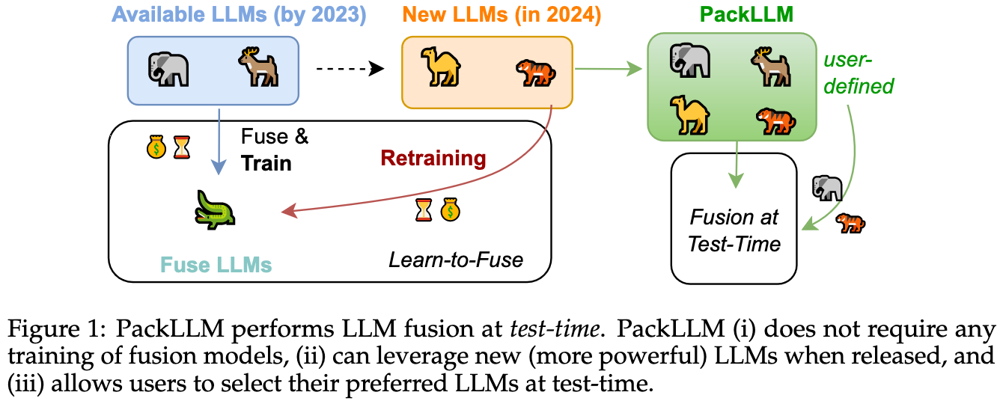

# Pack of LLMs: Model Fusion at Test-Time via Perplexity Optimization

We introduce Pack of LLMs (PackLLM), an effective method for test-time fusion that leverages each LLM’s expertise, given an input prompt. PackLLM performs model fusion by solving an optimization problem for determining each LLM’s importance, so that perplexity over the input prompt is minimized. First, our simple PackLLM-sim variant validates that perplexity is a good indicator for measuring each LLM’s expertise. Second, our PackLLM-opt variant approximately solves the perplexity minimization problem via a greedy algorithm. The derived importance weights are used to combine the LLMs during inference.



## Directory Layout
```bash
./
|---- downstream_tasks/                      # downstream task experiments with PackLLM
|---- language_modeling_tasks/                         # to be updated soon.
```


## Citation
```
@article{mavromatis2024packllm,
  title={Pack of LLMs: Model Fusion at Test-Time via Perplexity Optimization},
  author={Mavromatis, Costas and Karypis, Petros and Karypis, George},
  journal={arXiv preprint arXiv:2404.11531},
  year={2024}
}

```
